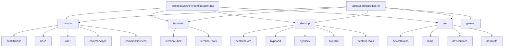

# dotfiles

Personal repository for my first attempt at using NixOS, if you somehow found this repo, it is probably not a good idea to reproduce my setup as I am still learning. There is also a pretty good deal of "Vibe Configuring", the following documentation is AI generated.

> [!NOTE]
> This repo does **not** use Home Manager. System configuration is handled entirely through NixOS modules. User-level app config (Hyprland, Wezterm, Zsh, Rofi…) lives in `homeconf/` as plain files and is symlinked manually.

---

## Table of Contents

- [[#Repository Layout]]
- [[#How the NixOS Flake Works]]
- [[#Module Architecture]]
- [[#Feature Modules]]
  - [[#common — Shared Base]]
  - [[#terminal — Shell & CLI Tools]]
  - [[#desktop — Hyprland GUI]]
  - [[#dev — Development Tooling]]
  - [[#gaming — Games]]
- [[#Hosts]]
- [[#Headless Mode]]
- [[#homeconf — App Config Files]]
- [[#Zsh Configuration]]
- [[#Deploying]]
- [[#Adding a New Module]]
- [[#Common Operations]]

---

## Repository Layout

```
dotfiles/
├── nixos/                        # NixOS flake (declarative system config)
│   ├── flake.nix                 # Entry point — defines inputs and outputs
│   ├── flake.lock                # Locked dependency versions (commit this)
│   └── modules/
│       ├── features/             # Reusable feature modules
│       │   ├── common/           # Locale, user, base settings, shared apps
│       │   ├── desktop/          # Hyprland, Waybar, Rofi, audio…
│       │   ├── terminal/         # Zsh, Wezterm, CLI tools
│       │   ├── dev/              # Dev tools, Docker, IDEs, LAMP stack
│       │   └── gaming/           # Steam, Prism Launcher
│       └── hosts/
│           ├── laptop/           # AMD laptop — bare metal Hyprland
│           └── proxmoxMachine/   # NVIDIA desktop — Hyprland via GPU passthrough
└── homeconf/
    └── laptop/                   # User-level app config files (symlinked manually)
        ├── hypr/                 # Hyprland, Hypridle, Hyprlock config
        ├── wezterm/              # Wezterm terminal config
        ├── zsh/                  # Zsh config (modular, framework-free)
        ├── rofi/                 # Rofi launcher themes and scripts
        ├── zed/                  # Zed editor config
        └── git/                  # Git config
```

---

## How the NixOS Flake Works

> [!TIP]
> If you're new to Nix flakes, think of a flake as a **lockfile-based project file** for your system config. `flake.nix` declares what external packages/libraries you depend on (inputs) and what your system builds to (outputs).

The `flake.nix` uses two libraries:

| Library | What it does |
|---|---|
| **[flake-parts](https://flake.parts/)** | Provides a structured way to define flake outputs using composable "modules" |
| **[import-tree](https://github.com/vic/import-tree)** | Automatically imports every `.nix` file found under `modules/` — no manual registration needed |

When you run `nixos-rebuild`, Nix reads `flake.nix`, resolves inputs from `flake.lock`, discovers all modules under `modules/` via `import-tree`, then builds the full system configuration for the requested host.

```nix
// flake.nix (simplified)
outputs = inputs:
  flake-parts.lib.mkFlake { inherit inputs; } {
    imports = [ (import-tree ./modules) ];  // auto-loads everything under modules/
  };
```

> [!IMPORTANT]
> Because `import-tree` auto-discovers files, **creating a new `.nix` file is enough to register it**. You do not need to manually add it to any list — just define your module and import it where you need it.

---

## Module Architecture

Every `.nix` file under `modules/features/` follows the same pattern:

```nix
{ self, ... }:
{
  flake.nixosModules.<moduleName> =   // registers the module in the flake
    { pkgs, config, lib, ... }:       // NixOS module arguments
    {
      environment.systemPackages = with pkgs; [ ... ];
      // ... any NixOS options
    };
}
```

The outer layer (`{ self, ... }`) is a **flake-parts module** — it registers the inner NixOS module under a name. The inner layer (`{ pkgs, config, lib, ... }`) is a standard **NixOS module**.

### Composite modules

Some directories have a `default.nix` that does nothing but import the other modules in that directory. This is the entry point you import in a host config.

```
desktop/
├── default.nix       ← composite: imports core, hyprland, hyprlock, hypridle, tools
├── core.nix          ← audio, XDG portal, GTK theme
├── hyprland.nix      ← Hyprland compositor
├── hyprlock.nix      ← lock screen
├── hypridle.nix      ← idle daemon
└── tools.nix         ← Waybar, Rofi, Dunst, Thunar
```

A host imports only `self.nixosModules.desktop` and gets everything automatically.

### Dependency graph



---

## Feature Modules

### common — Shared Base

**Path:** `modules/features/common/`

Everything that every host always needs.

| File | Module ID | What it provides |
|---|---|---|
| `default.nix` | `common` | Composite — imports all of the below |
| `options.nix` | `hostOptions` | Declares the `myConfig.headless` toggle |
| `base.nix` | `base` | Timezone, locale, keyboard layout, `nix.settings`, autologin |
| `user.nix` | `user` | `users.users.thomas` base definition and group membership |
| `apps.nix` | `commonApps` | CLI tools always; GUI apps only when not headless |
| `services.nix` | `commonServices` | `udisks2` (USB automount), `devmon` |

> [!NOTE]
> **GUI apps that are gated by headless mode** (see [[#Headless Mode]]): browsers, Discord, Vesktop, WhatsApp, OBS, Spotify, Proton suite, Parsec, Moonlight, qBittorrent, mpv, Termius.

---

### terminal — Shell & CLI Tools

**Path:** `modules/features/terminal/`

| File | Module ID | What it provides |
|---|---|---|
| `default.nix` | `terminal` | Composite — imports shell and tools |
| `shell.nix` | `terminalShell` | Enables Zsh system-wide, autosuggestions, syntax highlighting |
| `tools.nix` | `terminalTools` | CLI tools (always); Wezterm terminal emulator (GUI hosts only) |

**Always-installed CLI tools:** `fastfetch`, `yazi`, `micro`, `htop`, `eza`, `bat`, `fzf`, `fd`, `zoxide`, `direnv`, `tree`, `git`, `curl`, `lsof`, `unzip`, `p7zip`, `iproute2`, `unrar`, `pciutils`

---

### desktop — Hyprland GUI

**Path:** `modules/features/desktop/`

| File | Module ID | What it provides |
|---|---|---|
| `default.nix` | `desktop` | Composite — imports all desktop modules |
| `core.nix` | `desktopCore` | PipeWire audio, XDG portal, GTK/cursor theme, session env vars |
| `hyprland.nix` | `hyprland` | Hyprland compositor, XWayland, Qt Wayland, Hyprpaper, Kitty; also sets up Zsh auto-start |
| `hyprlock.nix` | `hyprlock` | Hyprlock screen locker package |
| `hypridle.nix` | `hypridle` | Hypridle idle daemon package |
| `tools.nix` | `desktopTools` | Waybar, Rofi, Cliphist, Dunst, Thunar, Quickshell |

> [!TIP]
> Hyprland, Hypridle, and Hyprlock are **configured via files in `homeconf/laptop/hypr/`**, not through NixOS options. The modules here only install the packages and enable the Hyprland program option.

---

### dev — Development Tooling

**Path:** `modules/features/dev/`

| File | Module ID | What it provides |
|---|---|---|
| `default.nix` | `dev` | Composite — imports all dev modules |
| `tools.nix` | `devTools` | Language runtimes, LSPs, CLI dev tools (always); GUI editors when not headless |
| `jetbrains.nix` | `devJetbrains` | JetBrains IDEs — only installed on GUI hosts |
| `services.nix` | `devServices` | Docker daemon, Portainer container, adds `thomas` to `docker` group |
| `lamp.nix` | `lamp` | Apache + MariaDB + PHP stack — **opt-in**, disabled by default |

**Always-installed dev tools:** `symfony-cli`, `php85`, `apacheHttpd`, `nil`, `nixd`, `d2`, `python315`, `docker`, `docker-client`, `nodejs`, `claude-code`, `helix`

**GUI-only dev tools:** `zed-editor-fhs`, `vscode-fhs`, `filezilla`, `gnome-builder`, `figma-linux`

**GUI-only IDEs:** PhpStorm, WebStorm, DataGrip, PyCharm, IntelliJ IDEA

#### LAMP Stack

The `lamp` module is a proper NixOS module with options. Enable it per-host:

```nix
services.lamp = {
  enable = true;
  user = "thomas";       // Apache runs as this user
  // docRoot defaults to ~/www
};
```

When enabled, it configures Apache with PHP (and common extensions), MariaDB, creates a `~/www` directory, and sets up an Adminer interface at `http://localhost/adminer`.

---

### gaming — Games

**Path:** `modules/features/gaming/`

| File | Module ID | What it provides |
|---|---|---|
| `gaming.nix` | `gaming` | Steam, Prism Launcher |

Only imported on the laptop.

---

## Hosts

### laptop

**Path:** `modules/hosts/laptop/`

| Setting | Value |
|---|---|
| Hardware | AMD CPU, NVMe storage |
| Display | Bare metal Hyprland on Wayland |
| Bootloader | systemd-boot |
| Networking | NetworkManager + wireless |
| Extras | Tailscale (client), power-profiles-daemon, LAMP stack |

Imports: `common` → `terminal` → `desktop` → `gaming` → `dev`

### proxmoxMachine

**Path:** `modules/hosts/proxmoxMachine/`

| Setting | Value |
|---|---|
| Hardware | NVIDIA GPU (passthrough from Proxmox host) |
| Display | Hyprland via GPU passthrough |
| Bootloader | systemd-boot |
| Networking | NetworkManager |
| Extras | Tailscale (client), OpenSSH, Sunshine game streaming, Seatd, uinput |

Imports: `common` → `terminal` → `desktop` → `dev`

> [!NOTE]
> The proxmoxMachine loads the full Hyprland desktop. To run it fully headless (no GPU passthrough), set `myConfig.headless = true` and remove the `desktop` import.

---

## Headless Mode

The `myConfig.headless` option (declared in `common/options.nix`, default `false`) gates all GUI-dependent packages across the config. When set to `true`, the following are skipped:

- All GUI apps in `common/apps.nix` (browsers, communication, media…)
- Wezterm terminal emulator
- Zed, VSCode, Figma, Gnome Builder, FileZilla
- All JetBrains IDEs

To use a host headlessly, set the option in its `configuration.nix`:

```nix
myConfig.headless = true;
```

You would also want to remove the `desktop` import from that host's imports list, since Hyprland and its companions are not useful on a headless machine.

> [!TIP]
> CLI tools (fzf, bat, eza, helix, git, docker, nodejs, python, etc.) are **never gated** — they are always installed regardless of the headless flag.

---

## homeconf — App Config Files

`homeconf/laptop/` contains the actual runtime configuration for apps. These are plain config files (not generated by Nix) and need to be **symlinked manually** to `~/.config/`.

```bash
# Example: symlink Hyprland config
ln -s ~/dotfiles/homeconf/laptop/hypr ~/.config/hypr

# Example: symlink Rofi config
ln -s ~/dotfiles/homeconf/laptop/rofi ~/.config/rofi
```

| Directory | Symlink target | Contents |
|---|---|---|
| `hypr/` | `~/.config/hypr/` | `hyprland.conf`, `hypridle.conf`, `hyprlock.conf` |
| `wezterm/` | `~/.config/wezterm/` | Wezterm Lua config |
| `zsh/` | sourced from `~/.zshrc` | Modular Zsh config files |
| `rofi/` | `~/.config/rofi/` | `config.rasi`, `cybrcyan.rasi`, launcher scripts |
| `zed/` | `~/.config/zed/` | Zed editor settings |
| `git/` | `~` | `.gitconfig` |

> [!WARNING]
> Edit files **directly in `homeconf/`**, not in `~/.config/`. The symlinks point back to the repo, so edits in either location affect the same file — but making edits inside `~/.config/` without realising it can be confusing. Keeping the mental model clear: `homeconf/` is the source of truth.

---

## Zsh Configuration

**Path:** `homeconf/laptop/zsh/`

Framework-free, modular Zsh config. The `.zshrc` sources each `.zsh` file in order.

| File | Purpose |
|---|---|
| `.zshrc` | Entry point — sources all modules |
| `options.zsh` | Shell options and environment variables |
| `history.zsh` | History settings and deduplication |
| `completions.zsh` | Completion system (colors, keyboard-navigable) |
| `keybindings.zsh` | Keyboard shortcuts |
| `navigation.zsh` | Directory navigation aliases |
| `prompt.zsh` | Prompt with git status indicators |
| `aliases-general.zsh` | Utility aliases (uses safe flags: `rm -i`, etc.) |
| `aliases-git.zsh` | Git shortcuts |
| `functions.zsh` | Utility functions (`extract`, `serve`, etc.) |
| `tools.zsh` | fzf, zoxide, direnv, nvm, pyenv integrations |
| `path.zsh` | PATH configuration |

Zsh plugins (autosuggestions, syntax highlighting) are provided by NixOS via `terminal/shell.nix` — no plugin manager needed.

To add machine-specific settings without touching the repo, create `~/.zshrc.local` — it is sourced automatically if present.

---

## Deploying

> [!IMPORTANT]
> Run these commands from inside the `nixos/` directory (where `flake.nix` lives), or pass the path explicitly with `--flake /path/to/nixos`.

```bash
cd ~/dotfiles/nixos

# Build and activate on the current machine
sudo nixos-rebuild switch --flake .#laptop
sudo nixos-rebuild switch --flake .#proxmoxMachine

# Test a build without activating (useful before committing)
sudo nixos-rebuild build --flake .#laptop

# Check the flake for errors without building
nix flake check

# Show all outputs the flake exposes
nix flake show

# Update all inputs to their latest versions
nix flake update

# Update only one input (e.g. nixpkgs)
nix flake update nixpkgs
```

> [!WARNING]
> After `nix flake update`, always do a test build (`nixos-rebuild build`) before switching. Updating `hyprland` input especially can introduce breaking changes.

---

## Adding a New Module

### 1. Create the file

Add a `.nix` file anywhere under `modules/features/`. `import-tree` will discover it automatically.

```nix
// modules/features/<category>/<name>.nix
{ self, ... }:
{
  flake.nixosModules.<moduleName> =
    { pkgs, config, lib, ... }:
    {
      environment.systemPackages = with pkgs; [
        some-package
      ];
    };
}
```

> [!TIP]
> The module ID (`<moduleName>`) is what you reference as `self.nixosModules.<moduleName>` in imports. It does not have to match the filename, but keeping them aligned avoids confusion.

### 2. Import it where needed

Either add it to the relevant composite `default.nix`:

```nix
// modules/features/<category>/default.nix
imports = [
  self.nixosModules.existingModule
  self.nixosModules.<moduleName>   // add here
];
```

Or import it directly in a host's `configuration.nix` if it is host-specific.

### 3. Guard GUI packages (if applicable)

If the module installs GUI applications, wrap them in `lib.optionals`:

```nix
environment.systemPackages =
  (with pkgs; [ always-installed-cli-tool ])
  ++ lib.optionals (!config.myConfig.headless) (with pkgs; [
    gui-application
  ]);
```

---

## Common Operations

### Roll back if something breaks

```bash
# Boot into the previous generation (select from bootloader menu)
# Or from a running system:
sudo nixos-rebuild switch --rollback
```

### Search for a package

```bash
nix search nixpkgs <package-name>
```

### Open a temporary shell with a package

```bash
nix shell nixpkgs#<package-name>
```

### Check what changed between generations

```bash
nvd diff /run/current-system $(ls -d /nix/var/nix/profiles/system-* | tail -2 | head -1)
```

### Garbage collect old generations

```bash
# Remove generations older than 7 days
sudo nix-collect-garbage --delete-older-than 7d

# Remove all old generations (keep only current)
sudo nix-collect-garbage -d
```
